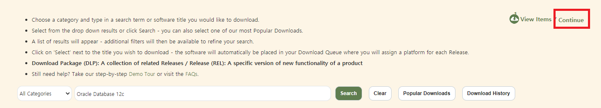
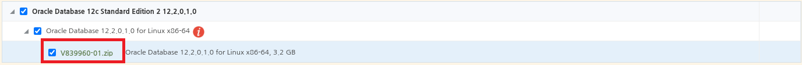
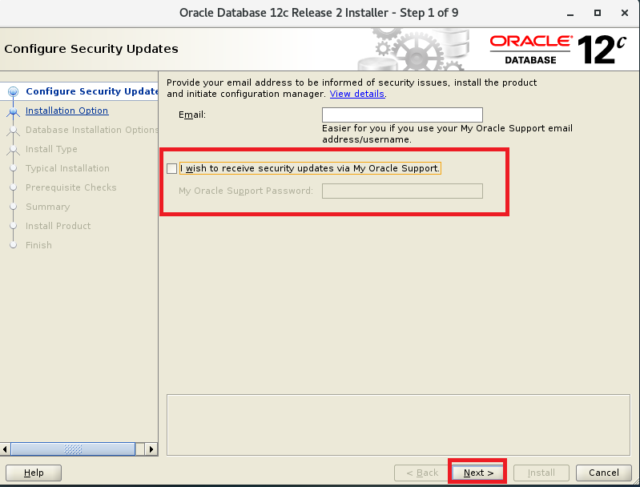
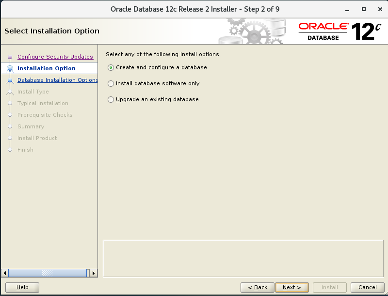
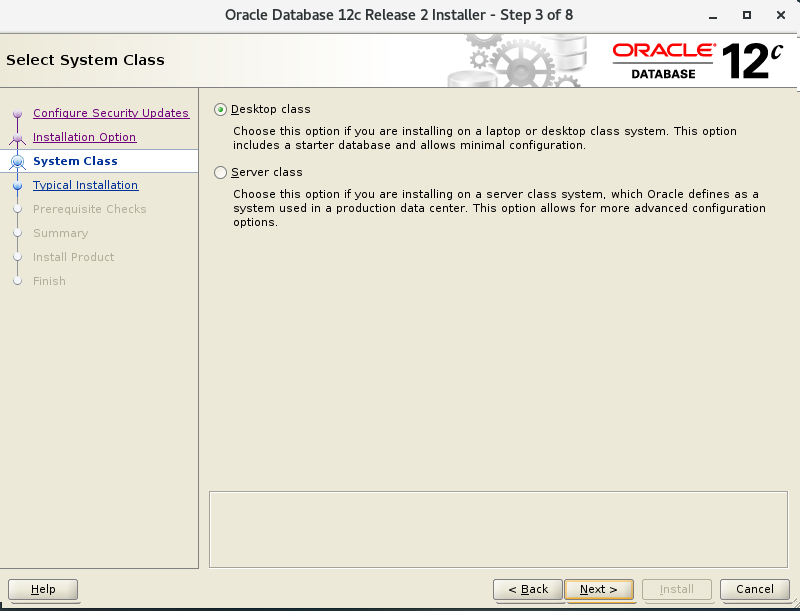
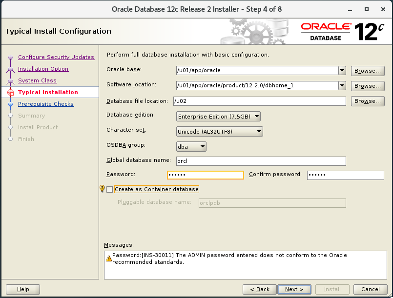
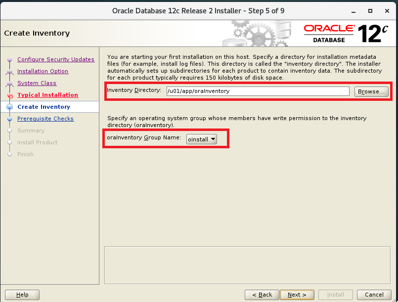
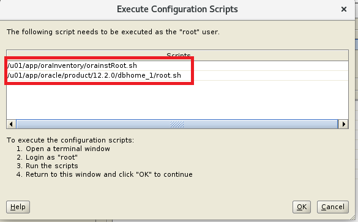
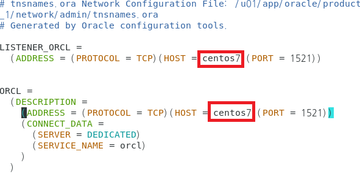
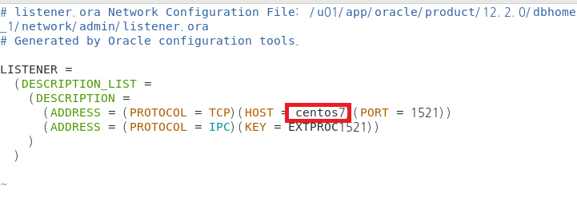

# 오라클 설치 12C 설치 - CentOS7  

CentOS7을 기준으로 하여 오라클을 설치한다.  
설치할 오라클 버전은 12C를 기준으로 한다.  
오라클 설치는 GUI 모드로 진행한다.

- [How to Install Oracle Database 12c on CentOS 7](https://www.howtoforge.com/tutorial/how-to-install-oracle-database-12c-on-centos-7/)

## 1. 패키지 설치
필요한 패키지들을 설치한다.

```bash
yum install -y binutils.x86_64 compat-libcap1.x86_64 gcc.x86_64 gcc-c++.x86_64 glibc.i686 glibc.x86_64 \
glibc-devel.i686 glibc-devel.x86_64 ksh compat-libstdc++-33 libaio.i686 libaio.x86_64 libaio-devel.i686 libaio-devel.x86_64 \
libgcc.i686 libgcc.x86_64 libstdc++.i686 libstdc++.x86_64 libstdc++-devel.i686 libstdc++-devel.x86_64 libXi.i686 libXi.x86_64 \
libXtst.i686 libXtst.x86_64 make.x86_64 sysstat.x86_64
```

## 2. 계정 생성
oracle이름의 계정을 생성하고 디폴트 그룹으로 oinstall 그룹을 보조 그룹으로 dba를 설정하고  
비밀번호를 설정한다.
```bash
groupadd oinstall
groupadd dba
useradd -g oinstall -G dba oracle
passwd oracle
TYPE THE PASSWORD
```

## 3. 커널 파라미터 설정
오라클 설치를 위해서는 커널 파라미터 설정이 필요하다 
```bash
vim /etc/sysctl.conf # 파일 오픈

# 커널 파라미터 설정
fs.aio-max-nr = 1048576
fs.file-max = 6815744
kernel.shmall = 2097152
kernel.shmmax = 2147483648
kernel.shmmni = 4096
kernel.sem = 250 32000 100 128
net.ipv4.ip_local_port_range = 9000 65500
net.core.rmem_default = 262144
net.core.rmem_max = 4194304
net.core.wmem_default = 262144
net.core.wmem_max = 1048586
```

## 4. 커널 파라미터가 제대로 적용되었는지 확인하고 실제로 커널 파라미터 값을 적용한다.
```bash
sysctl -p
sysctl -a
```

## 5. 오라클 사용자의 몇가지 제한 사항을 구성하고, 프로세스의 최대 갯수와 오픈된 파일 디스크립터들의 최대 갯수를 지정한다. 

여기까지 진행한다면 새롭게 생성된 oracle에 대한 계정과 시스템 구성이 완료된 것이다.

```bash
vim /etc/security/limits.conf # 파일 오픈

# 파일에 값 설정
oracle soft nproc 2047
oracle hard nproc 16384
oracle soft nofile 1024
oracle hard nofile 65536
```

## 6. 원격에서 SSH 포워딩을 이용하여 GUI 인스톨을 하고 싶다면 다음과 같이 설정한다 
```bash
yum groupinstall -y "X Window System"
```

설치가 되었다면 생성한 oracle 계정으로 로그인한다.

```bash
ssh -X oracle@192.168.33.15
```

## 7. 오라클을 다운 받는다.
[https://edelivery.oracle.com/osdc/faces/SoftwareDelivery](https://edelivery.oracle.com/osdc/faces/SoftwareDelivery)로 이동한다.  
검색창에서 12c를 검색한다.  


Standard Edition을 클릭하여 선택한다.  


오른쪽 상단에 continue를 클릭한다.  


파일명을 클릭하여 다운로드를 받는다. 


## 8. 다운 받은 파일의 압축을 푼다
```bash
mkdir /stage
unzip V839960-01.zip -d /stage/
```

## 9. 오라클 디렉터리의 owner 및 group을 변경한다.
```bash
chown -R oracle:oinstall /stage/
```

## 10. 오라클 설치 파일과 오라클 데이터 베이스 파일을 위한 디렉터리 생성 
여기서 디렉터리 'u01' 오라클 설치 파일들을 위한 디렉터리이며 'u02'는 오라클 데이터베이스 파일을 위한 디렉터리다.  
```bash
mkdir -p /u01 /u02
```

생성한 /u01과 /02 디렉터리에 대한 owner 및 group을 변경해주고 퍼미션을 설정해 준다.
```bash
chown -R oracle:oinstall /u01 /u02
chmod -R 775 /u01 /u02
chmod g+s /u01 /u02 # 소유주와 같은 권한으로 파일 실행 가능(setuid bit)
```

## 11. 설치 파일을 실행한다. - 소유주가 oracle 계정이므로 oracle 계정으로 실행해야한다.
**중요 : 리눅스 GUI에서 사용자 바꾸기 통해 oracle 계정으로 접속 후 실행**
```bash
echo $LANG #현재 $LANG 설정 확인
ko_KR.UTF-8

export LANG=c #설치 화면 한글 깨짐 방지


cd /stage/database/
./runInstaller
```
## 12. GUI 설치






다음과 같은 메시지가 나올 때 메시지에 나온 파일을 `root` 권한으로 실행시킨 후 다시 진행한다.




## 13. tnsnames.ora 파일 수정
외부에서 오라클에 접속하기 위해서는 tnsnames.ora 파일 수정이 필요하다.  
```bash
cd /u01/app/oracle/product/12.2.0/dbhome_1/network/admin
vi tnsnames.ora
```
호스트 명을 localhost에서 서버 oracle이 설치된 서버 호스트명으로 변경한다.  


`/etc/hosts` 파일을 수정한 후  centos7 호스트명에 서버아이피를 매핑 시켜준다.  
```bash
vi /etc/hosts
192.168.111.222 centos7
```

## 14. listener.ora 파일 수정
호스트 명을 localhost에서 서버 oracle이 설치된 서버 호스트명으로 변경한다.  



## 15. tns리스너 실행을 위한 경로 추가 및 명령 실행
```bash
 find . -name lsnrctl 2>> /dev/null
./u01/app/oracle/product/12.2.0/dbhome_1/bin/lsnrctl

cd 
vi .bashrc
export ORACLE_HOME=/u01/app/oracle/product/12.2.0/dbhome_1
export ORACLE_SID=orcl
export PATH=$ORACLE_HOME/bin:$PATH

# lsnrctl(오라클 리스너) 명령 실행
lsnrctl <start | stop | status> 

# sqlplus로 디비 접속
sqlplus / as sysdba

# 디비 로드
startup

# 디비 셧다운
shutdown [immediate | normal | abort | transactional]

shutdown normal:
새로운 연결 차단: 더 이상 새로운 사용자 연결을 허용하지 않는다.
기존 세션 유지: 이미 연결된 사용자가 자발적으로 세션을 종료할 때까지 기다린다.
안전한 종료: 데이터 무결성을 완전히 유지하며 종료된다.
주의 사항: 사용자가 로그아웃하지 않으면 종료 시간이 무기한 연장될 수 있다.

shutdown transactional:
새로운 연결 차단: 새로운 사용자 연결을 허용하지 않는다.
현재 트랜잭션 완료 대기: 이미 시작된 트랜잭션이 완료될 때까지 기다린다.
세션 종료: 트랜잭션이 완료된 세션부터 순차적으로 종료된다.
용도: 활성 트랜잭션을 방해하지 않고 종료하고자 할 때 사용한다.

shutdown immediate:
새로운 연결 차단: 더 이상 새로운 사용자 연결을 허용하지 않는다.
트랜잭션 롤백: 진행 중인 모든 트랜잭션을 롤백한다.
세션 강제 종료: 모든 사용자 세션을 즉시 종료한다.
빠른 종료: 데이터 무결성을 유지하면서도 빠르게 종료한다.

shutdown abort:
즉시 강제 종료: 진행 중인 트랜잭션이나 세션을 고려하지 않고 즉시 종료한다.
인스턴스 복구 필요성: 다음에 데이터베이스를 시작할 때 인스턴스 복구가 필요할 수 있다.
주의 사항: 데이터 손실이나 손상의 위험이 있으므로 최후의 수단으로만 사용해야 한다.
```
